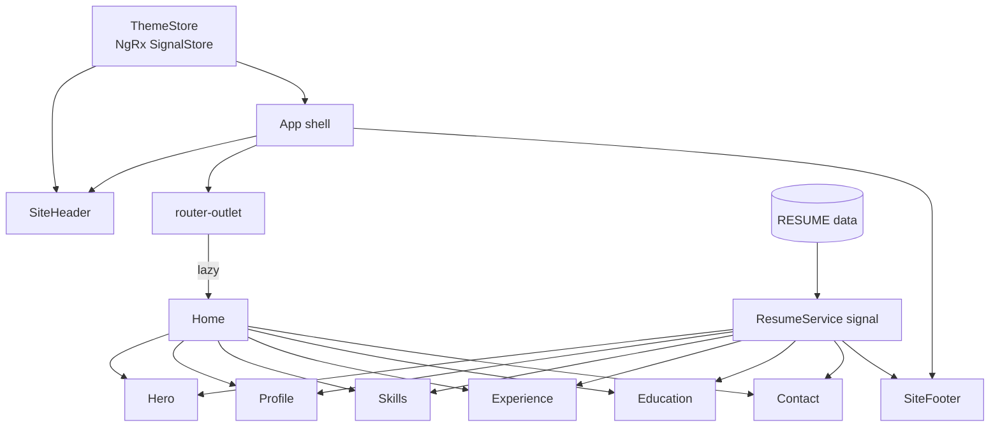
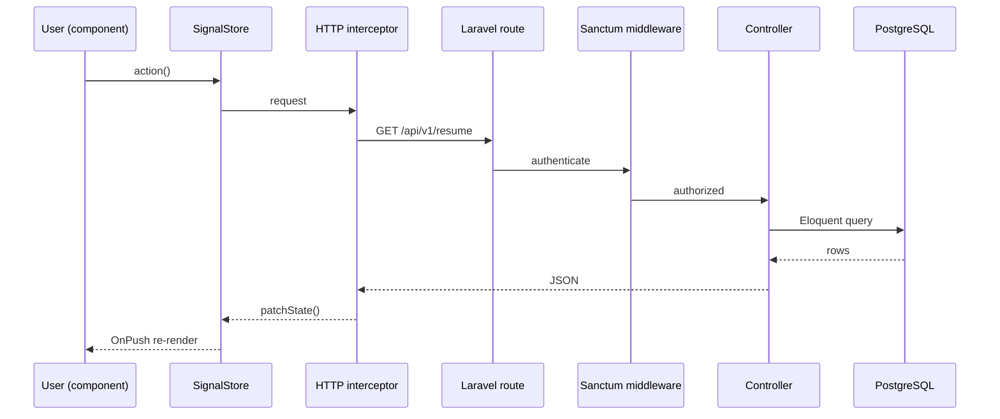

# Architecture

This document explains how the front end is put together and how it will connect
to the Laravel API as the interactive demos land.

## Component composition

The page is a composition of small, standalone, `OnPush` components. Each section
owns its markup and styles and reads content from a signal — none of them know
where that content came from.

## Data flow today

Content is a typed constant (`core/data/resume.data.ts`) exposed as a read-only
signal by `ResumeService`. Components call `computed()` selectors over it. This
keeps content and presentation separate and makes the CV exportable as JSON, a
PDF, or an API payload without touching the UI.

## Data flow tomorrow (the X-Ray demo)

The reason this is a full-stack portfolio and not a static page: the planned
**Under-the-hood X-Ray** visualises a real request travelling the whole stack.
The service boundary is already in place — `ResumeService` will swap its static
signal for an HTTP call with no change to any consumer.

Each hop in that diagram is a stage the visualiser will light up in sequence —
blue while data is in flight, red if the security lab’s exploit fires.

## State management

Only genuinely shared state lives in a store. Right now that is the theme
(`ThemeStore`, an NgRx SignalStore). Everything else is local component state or
derived `computed()` values. See [ADR-0002](adr/0002-state-with-ngrx-signals.md).

## Rendering & routing

The landing page is one lazily-loaded route. Anchor navigation with
`withInMemoryScrolling` drives the section jumps, and a wildcard route keeps deep
links safe. `provideHttpClient(withFetch())` is already wired for the API.
