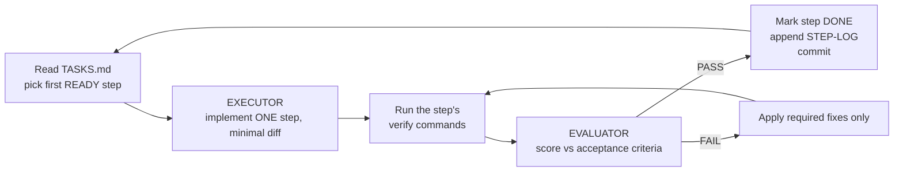

# GymTracker build harness

A small, model-agnostic system for building the GymTracker feature **one verified
step at a time**, so a fast/cheap model (Sonnet) can execute the whole plan
without drifting, and a second model (Opus, or a fresh Sonnet) checks every step
against the plan before anything is committed.

It works in Claude Code, Cursor, Gemini CLI, Windsurf, Junie — anything that can
read files in the repo. Two of the files are also packaged as Claude Code skills
for `/`-invocation.

## The pieces

| File | Role |
|---|---|
| `TASKS.md` | **The ledger.** Ordered, atomic steps with acceptance criteria + verify commands + status. The single source of truth for "what's next" and "are we done". |
| `EXECUTOR.md` | How the builder model behaves: one step per cycle, minimal diff, never mark done on a red check, never drift out of scope. |
| `EVALUATOR.md` | How the reviewer model behaves: an objective PASS/FAIL rubric tied to the step's acceptance criteria and the plan. |
| `CONVENTIONS.md` | The guardrails distilled from `AGENTS.md`, the API layering, and the spec. The executor may not invent patterns outside this. |
| `PARSING.md` | The log-notation grammar the importer + NL agent must implement. |
| `fixtures/` | Real training-log corpus = catalog source, importer input, parser eval set. |
| `STEP-LOG.md` | Append-only audit trail: one entry per step with the evaluator verdict. |

The plan those steps implement is `../gym-tracker-architecture.md`.

## The loop (this is the whole trick)

Three rules make "never get lost" hold:

1. **State lives on disk, not in context.** Progress is `TASKS.md` status + the git history, so a fresh session (or a compacted context) resumes correctly by re-reading the ledger. Losing the conversation loses nothing.
2. **One step per cycle, and a step is small enough to verify.** The executor is forbidden from starting step N+1 until N is `DONE`.
3. **A different reviewer gates advancement.** The builder cannot pass its own homework; only an `EVALUATOR` verdict of PASS flips a step to `DONE` and allows a commit.

## Run modes

**Mode A — Claude Code, auto-evaluated (recommended).**
Main agent = Sonnet running `EXECUTOR.md` (or the `gym-build` skill). After it
finishes a step and runs the checks, it spawns an **Evaluator subagent** (the
`gym-review` skill / `EVALUATOR.md`) via the Task tool — ideally on Opus for an
independent, stronger reviewer — passing the step ID, the `git diff`, and the
check output. Only a PASS lets the main agent mark the step DONE and commit.

**Mode B — two windows, any tools.**
Window 1 runs the executor. Window 2 (a different model/session) runs the
evaluator on the pasted diff + check output. You relay the verdict. Slower, fully
model-agnostic, and a good way to use Opus-as-judge over a Sonnet builder.

**Mode C — solo with a checkpoint.**
One model does both, but must literally switch hats: after implementing, it
re-reads `EVALUATOR.md` and reviews its own diff against the criteria before
committing. Weakest independence; fine for the trivial scaffold steps.

## How to start

1. Read `../gym-tracker-architecture.md` and answer its §14 open decisions (units, Neon scope, media, model, catalog size). Record them as ADRs.
2. Open `TASKS.md`; the first `READY` step is P0-1.
3. Point Sonnet at `EXECUTOR.md` and say: *"Execute the next READY step."*
4. When it reports the step complete with green checks, run the evaluator on it.
5. Repeat. Each phase (P0→P4) ends in something demo-able.

## Definition of Done (global gate — every step)

A step is only `DONE` when, for the code it touched, **all** apply:

- Frontend: `npm run typecheck` · `npm test` · `npm run format:check` · `npm run build` all green; `npm run api:types` clean if the contract changed.
- Backend: `composer test` (PHPUnit) · `./vendor/bin/pint --test` green; migrations run on a fresh DB.
- Only files in the step's declared scope changed.
- New behavior has a test; accessibility (AXE / WCAG-AA) holds for any UI.
- An `EVALUATOR` PASS is recorded in `STEP-LOG.md`.
