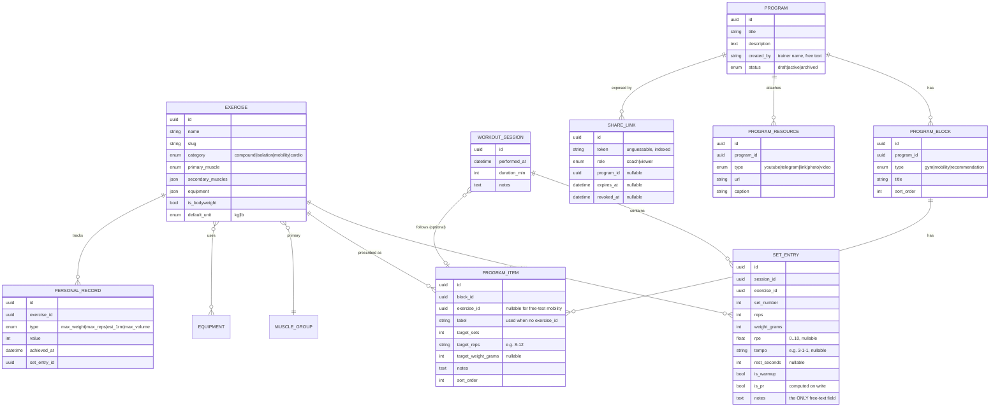

# GymTracker — Architecture & MVP Spec

> A training-log + trainer-program feature added to the existing `portfolio-app`
> (Angular 21) / `portfolio-api` (Laravel 13) portfolio. Personal-use MVP, no
> auth, agentic AI as the portfolio centerpiece, everything on free tiers.
>
> **Status:** proposal for review · **Author:** drafted with Claude · **Date:** 2026-07-24

---

## 1. What we're building (and why it belongs here)

A gym-training tracker with three faces:

1. **Athlete (you)** — log workouts through a fast, fully-selectable form; see progress in an Apple-style dashboard (total volume lifted, per-exercise weight progression, PRs, frequency, muscle balance).
2. **Trainer (via a secret share link, no login)** — build programs: gym blocks, mobility, recommendations, YouTube/Telegram links, and uploaded photos/videos.
3. **AI coach layer** — the "wow": an **AI progress coach** that reads your history and advises, an **AI program drafter** that turns the trainer's plain-language goals into an editable structured program, and a labeled-stretch **talking-head AI coach** that narrates.

### Why not a new repo

The single most impressive thing to a senior reviewer is watching your *existing, cleanly-architected* system grow a second bounded context without breaking its patterns. So GymTracker is **a new lazy feature module in `portfolio-app`** and **a new domain slice in `portfolio-api`** — same `ApiResponse` envelope, same Controller → Service → Repository layering, same OpenAPI-as-source-of-truth codegen, same WCAG-AA + Signals discipline from your `AGENTS.md`. Reuse *is* the signal.

### MVP goals

- Log a workout in under ~15 seconds with almost no typing (everything selectable; notes are the only free-text field).
- Durable data (survives Render redeploys) → **Neon Postgres**.
- Dashboard that looks like it came out of Cupertino and reads clearly in light **and** dark (you already have a `ThemeStore`).
- Trainer can author a full program from a shared link and attach media/links.
- At least one **genuinely agentic** AI flow wired end-to-end with tool-calling, structured output, guardrails, and a tiny eval suite.
- **$0/month** running cost.

### Explicit non-goals (MVP)

Multi-user accounts / real auth · social features · payments · native mobile app · offline sync · generated full-body exercise-form video (see §10). All are deliberately deferred but the schema and module boundaries are drawn so they slot in later.

---

## 2. System shape

```
┌────────────────────────────┐        HTTPS / JSON (ApiResponse envelope)
│  portfolio-app (Angular 21) │ ───────────────────────────────────────────┐
│  Vercel                     │                                             │
│                             │        SSE (streaming AI responses)         │
│  features/gym/  ← NEW       │ ◄───────────────────────────────────────────┤
└────────────────────────────┘                                             │
                                                                            ▼
                                            ┌───────────────────────────────────────┐
                                            │  portfolio-api (Laravel 13)  Render     │
                                            │  Http → Service → Repository            │
                                            │  app/Domain/Gym/  ← NEW                 │
                                            │  app/Services/Ai/ ← NEW (agent layer)   │
                                            └──────────────┬───────────────┬─────────┘
                                                           │               │
                                                  ┌────────▼──────┐  ┌─────▼─────────────┐
                                                  │ Neon Postgres │  │ Free LLM provider │
                                                  │ (data)        │  │ Groq / Gemini     │
                                                  └───────────────┘  └───────────────────┘
```

Media (trainer photos/videos) is the one place local disk hurts on Render's free tier — see §5.3 for the free object-storage option.

---

## 3. Domain model

Canonical unit is **kilograms** stored as integers in grams (avoids float drift); display converts to kg/lb per user preference. "Total kgs lifted" = Σ(`reps × weight`) over set entries = training **volume**.



Design notes worth calling out to a reviewer:

- **Everything selectable.** The catalog (`EXERCISE`, `MUSCLE_GROUP`, `EQUIPMENT`) is seeded, so the logging form is dropdowns + steppers, never free typing — except `notes`. Reps/weight/RPE/tempo/rest come from steppers and pickers.
- **`is_pr` computed on write** in the service layer, and mirrored into `PERSONAL_RECORD` for cheap dashboard reads. Estimated 1RM via Epley (`weight × (1 + reps/30)`), clearly labeled as an estimate.
- **Programs are recursive-but-shallow** (Program → Block → Item) which cleanly expresses "gym + mobility + recommendations" without over-engineering.
- **Sessions can optionally link to a `PROGRAM_ITEM`** so "planned vs. actual" becomes a future feature for free.

---

## 4. API design (`portfolio-api`)

Follows your existing conventions exactly: thin controllers returning `App\Support\ApiResponse::ok(...)`, logic in Services, data behind Repository interfaces, input via Form Requests, output via Resources, one OpenAPI spec as source of truth. New code lives under `app/Domain/Gym/` and `app/Services/Ai/`.

| Method | Path | Purpose |
|---|---|---|
| GET | `/api/v1/gym/exercises` | Seeded catalog (filter by muscle/equipment/category) |
| GET | `/api/v1/gym/sessions` | List workout sessions (paginated, date range) |
| POST | `/api/v1/gym/sessions` | Create a session with its set entries |
| GET | `/api/v1/gym/sessions/{id}` | One session |
| PATCH | `/api/v1/gym/sessions/{id}` | Edit session / sets |
| DELETE | `/api/v1/gym/sessions/{id}` | Remove |
| GET | `/api/v1/gym/stats/overview` | Dashboard aggregates (total volume, PR count, streak, weekly frequency) |
| GET | `/api/v1/gym/stats/exercises/{id}` | Per-exercise progression series |
| GET | `/api/v1/gym/programs` | List programs |
| GET | `/api/v1/gym/programs/{id}` | One program (blocks, items, resources) |
| **Coach (token-gated)** | | |
| GET | `/api/v1/gym/coach/{token}` | Resolve share link → program editing context |
| POST | `/api/v1/gym/coach/{token}/programs` | Trainer creates a program |
| PATCH | `/api/v1/gym/coach/{token}/programs/{id}` | Trainer edits |
| POST | `/api/v1/gym/coach/{token}/resources` | Attach link / upload media |
| **AI** | | |
| POST | `/api/v1/gym/ai/coach` | Progress-coach agent (SSE stream) |
| POST | `/api/v1/gym/ai/program-draft` | Program-drafter agent → structured draft |
| POST | `/api/v1/gym/ai/narrate` | Talking-head script + (stretch) video job |

Aggregates (`/stats/*`) are computed in SQL in a repository, not in PHP loops — Postgres does `SUM(reps * weight_grams)`, window functions for PR detection, and `date_trunc('week', …)` for frequency. That keeps the dashboard fast and shows you reach for the right tool.

Token endpoints resolve the share link in a middleware (`ResolveShareLink`) that 404s on unknown/expired/revoked tokens — no auth framework, but not "open to the world" either.

---

## 5. Data, storage & infra

### 5.1 Neon Postgres (the one stack change)

Your CV data is read-only and seeded from config, so SQLite on Render is fine for *it*. A training log you write to daily is different: **Render's free disk is ephemeral and can be wiped on redeploy/restart**, which would silently lose workouts. Neon is serverless Postgres on a free tier, so the fix is a connection-string change, not a rewrite:

```env
DB_CONNECTION=pgsql
DB_URL=postgres://<user>:<pass>@<host>.neon.tech/<db>?sslmode=require
```

Keep the CV/demo tables on their current path if you like (Laravel supports multiple connections), or move everything to Neon for one source of truth. Neon's free tier comfortably covers a personal log; it also scales into the "paid features later" goal far better than SQLite, and gives you real Postgres features (window functions, JSONB) the dashboard benefits from today.

### 5.2 Migrations & seeders

Standard Laravel migrations per §3, plus an **`ExerciseCatalogSeeder`** with ~60–80 common movements (bench, squat, deadlift, OHP, rows, curls, mobility drills…) tagged with muscle/equipment. Seeding the catalog is what makes the form "all selectable."

### 5.3 Trainer media (photos/videos)

The only thing that doesn't fit ephemeral disk. Free options, in order of how little work they are: store on **Cloudflare R2** or **Supabase Storage** (both free tiers) and keep only the URL in `PROGRAM_RESOURCE`; or, for MVP-simplest, let the trainer paste links (YouTube/Telegram/Drive) and treat uploads as a fast-follow. Recommendation: ship links first, add R2 uploads in Phase 3.

---

## 6. Frontend (`portfolio-app`)

New lazy feature area, mirroring your `features/` + `core/` split and reusing the design system, `ThemeStore`, and command palette.

```
src/app/features/gym/
├─ gym.routes.ts                 # lazy-loaded, /gym/**
├─ dashboard/                    # Apple-style overview (stat tiles + charts)
├─ log/                          # the fast logging form (Reactive Forms)
├─ history/                      # session list + detail
├─ programs/                     # athlete-side program viewer
├─ coach/                        # trainer builder (token route /gym/coach/:token)
└─ ai/                           # coach chat panel + program-draft UI
src/app/core/
├─ api/gym-api.ts                # one typed client seam (matches api-client.ts)
├─ models/gym.models.ts          # view models
└─ state/gym.store.ts            # NgRx SignalStore: sessions, catalog, stats
```

Conventions carried over verbatim from `AGENTS.md`: standalone components, `input()`/`output()`, `computed()` for derived state, `OnPush`, native control flow (`@if`/`@for`), Reactive Forms (perfect for the log form), `class`/`style` bindings not `ngClass`/`ngStyle`, PrimeNG for pickers/steppers/tables, WCAG-AA and full keyboard support. API types are **generated** from the OpenAPI spec (`npm run api:types`) so the client can't drift from the server.

### 6.1 The logging form (the "15-second" flow)

Reactive form, one row per set, keyboard-first: pick exercise (searchable `p-select` over the seeded catalog) → sets/reps/weight via steppers → optional RPE/tempo/rest chips → notes only if you want them. "Repeat last set" and "same as last workout" buttons remove almost all input. Autosaves the session on submit via `gym-api`.

### 6.2 Apple-style dashboard

Design language: generous whitespace, large rounded "cards," restrained SF-style type scale, one calm accent, subtle depth (soft shadow + hairline border), spring-y micro-interactions, flawless dark mode via your existing theme tokens. Content:

- **Stat tiles** — Total volume lifted (all-time + this week, with delta), PRs this month, current streak, sessions this week.
- **Volume-over-time** area/line chart (weekly buckets).
- **Per-exercise progression** — pick a lift, see top-set weight climbing over time with PR markers.
- **Muscle-group balance** — how volume distributes across muscles (spot imbalances).
- **Frequency heatmap** — GitHub-contributions-style calendar of training days.

Charts should be built to a single visual system (consistent color roles, light/dark parity, accessible contrast, tasteful tooltips). When we build these, we'll run the **dataviz** guidance first so the palette and mark specs are coherent rather than ad-hoc.

---

## 7. The agentic AI layer — the portfolio centerpiece

This is where senior reviewers say "wow" — not because it's a fitness gimmick, but because you apply the *same* layered, testable discipline to LLMs that you applied to the REST API. Everything runs on a **free** provider.

### 7.1 Provider (free)

Use an **OpenAI-compatible** free endpoint so the client stays swappable behind an interface:

- **Groq** — Llama / open models, extremely fast, generous free tier. Great default for the coach + drafter.
- **Google Gemini** — free tier, strong structured-output + long context.
- **OpenRouter / Cerebras** — additional free models / fallback.

In Laravel: a thin `LlmClient` interface (or the `Prism` Laravel LLM package) with a `GroqLlmClient` binding — same Dependency-Inversion move you already use for `ResumeRepository`. Swapping providers is a container binding, nothing else.

### 7.2 Three agents

**A) AI Progress Coach (streaming, tool-calling).** You ask "how's my bench going / what should I do next?" The agent is given **read tools** — `get_recent_sessions`, `get_exercise_progression`, `get_prs`, `get_volume_trend` — calls them, reasons over the results, and returns advice with citations to your actual numbers. Streamed to the UI over SSE. This is *real* agentic tool-use over your own data, not a chatbot.

**B) AI Program Drafter (structured output).** The trainer (or you) writes "4-day upper/lower, focus on shoulders, 45 min sessions, I have dumbbells + a rack." The agent returns a **schema-validated** `ProgramDraft` (blocks → items with exercise IDs resolved against the catalog, sets/reps, notes) that lands in the trainer builder **pre-filled and fully editable**. Validation rejects hallucinated exercises (must resolve to a catalog ID), which is the guardrail story reviewers look for.

**C) Talking-head AI Coach (labeled stretch — see §10).** The agent writes a short coaching **script** from your data (cheap, free, always shippable); rendering that script as an avatar video is the optional, clearly-flagged flourish.

### 7.3 What makes it "senior-grade"

- **Tool-calling with typed tools** and a hard all; the model can only *read* your data, never write — mutations stay in the normal validated endpoints.
- **Structured output validated against a schema** (Form Request / DTO), so the agent's output is as trustworthy as any API input.
- **Guardrails**: exercise-ID resolution, unit sanity checks, refusal on medical/injury questions with a "see a professional" fallback.
- **A tiny eval suite** (`tests/Feature/Ai/*`): fixed transcripts → assert the agent calls the right tools and produces valid structured output. Evals in a portfolio project is a genuine differentiator.
- **Streaming UX** via SSE, **rate-limited** (free tiers + your own protection), with graceful degradation when the provider is down.

---

## 8. Trainer access — secret share link (no auth)

You picked the share-link model. Flow:

1. You generate a link from your side: `POST` creates a `SHARE_LINK` with a cryptographically-random `token` and `role=coach` (optionally scoped to one `program_id`, optionally with `expires_at`).
2. You send the trainer `https://<app>/gym/coach/<token>`.
3. That route resolves through `ResolveShareLink` middleware; unknown/expired/revoked → 404. Valid → the trainer sees the program builder (blocks, items, resource attach, AI drafter).
4. **Revoke** = set `revoked_at` (or rotate the token). No passwords, but not world-open, and cleanly upgradeable to real trainer accounts later because the `SHARE_LINK` already models role + scope.

`viewer` role is included so you can later share read-only progress with someone without giving edit rights.

---

## 9. Security & privacy (honest MVP posture)

No auth means the athlete data is effectively protected only by obscurity of the app URL, which is acceptable for a personal MVP you control — but the spec is explicit about it so a reviewer sees you *chose* it rather than missed it. Concretely: unguessable share tokens for the trainer, AI endpoints rate-limited and read-only over data, uploads (when added) type/size-validated and served from object storage, and CORS locked to your Vercel origin (you already do `FRONTEND_URL`). The upgrade path to Sanctum-based accounts is a Phase-4 line item, not a rewrite.

---

## 10. Can we do avatar exercise videos? — the honest answer

**Talking head narrating: yes, feasible (and there are free/self-hosted options).** **Full-body avatar demonstrating correct form: not reliably, and not for MVP.**

- Talking-head tools (HeyGen/Synthesia/D-ID, plus **free and open-source self-hosted** alternatives) turn a script into a presenter clip. Good for a "coach intro / weekly recap" narration — which is exactly agent **C**.
- Generative video of a body performing an exercise (Runway, Kling, Veo, Sora) still frequently produces anatomically wrong or physically impossible motion. In a fitness app that's a **safety problem** — bad form causes injury — so we don't ship generated form demos.
- Cost: the polished avatar tools are mostly paid, which fights your $0 rule; the free path is a self-hosted lip-sync + free TTS pipeline, which is real work.

**Recommendation:** for actual exercise form, use what you already planned — the trainer's YouTube/Telegram links and her own uploaded clips (that's what paid apps do too). Keep the AI talking-head as a **clearly-labeled stretch demo** ("AI-generated recap") so it reads as *judgment* — knowing when generative video is and isn't appropriate — which impresses senior devs more than a shaky generated squat. It's in scope per your pick, just sequenced last (Phase 4).

---

## 11. Roadmap (phased, each phase is demo-able)

**Phase 0 — Foundations.** Neon wired, `app/Domain/Gym` scaffolded, migrations + `ExerciseCatalogSeeder`, OpenAPI spec extended, `gym-api` client + types generated, empty lazy `/gym` route.

**Phase 1 — Vertical slice.** Logging form (fully selectable) → `POST sessions` → history list → dashboard with **total volume tile + volume-over-time chart** on real data. Proves the whole stack end-to-end.

**Phase 2 — Full dashboard.** Per-exercise progression, PR detection + markers, muscle-balance, frequency heatmap; polish the Apple-style design pass in light/dark.

**Phase 3 — Trainer + programs.** Share-link middleware, program builder (blocks/items/resources), link attachments; athlete-side program viewer; (optional) R2 uploads.

**Phase 4 — AI layer.** Progress-coach agent (tools + SSE) → program-drafter (structured output) → eval suite → talking-head recap (stretch).

Suggested build order to start: **Phase 0 → 1** as the first real code drop, because it de-risks everything and gives you something live to react to.

---

## 12. Cost summary — $0/month

| Concern | Choice | Cost |
|---|---|---|
| Frontend host | Vercel (existing) | Free |
| Backend host | Render Docker (existing) | Free |
| Database | **Neon Postgres** | Free tier |
| LLM / agents | Groq / Gemini free tier | Free |
| Media storage (Phase 3) | Cloudflare R2 / Supabase | Free tier |
| Talking-head (Phase 4, opt) | Self-hosted OSS / free tier | Free |

---

## 13. Why this makes senior devs say "wow"

Not the fitness features — the *engineering posture*: one coherent system growing a new bounded context without breaking its own rules; contract-first API with generated client types; SQL-side aggregation instead of PHP loops; an AI layer that is **layered, tool-using, schema-validated, guard-railed, and eval-tested** rather than a wrapper around a chat box; and visible judgment about where generative AI does and doesn't belong (the avatar call). It's small, but it's *right*, and it scales — which is exactly the story your `README`s and `AGENTS.md` already tell about the rest of the portfolio.

---

## 14. Open decisions before Phase 0

1. **Weight units** — store canonical kg (grams) and let display toggle kg/lb? (Recommended.)
2. **Neon scope** — move all tables to Neon, or Neon only for gym + keep CV on SQLite?
3. **Media in MVP** — links-only first, R2 uploads in Phase 3? (Recommended.)
4. **Primary AI model** — start on Groq (fastest) with Gemini as fallback? (Recommended.)
5. **Catalog size** — how many seeded exercises for v1 (~60–80 suggested)?
```